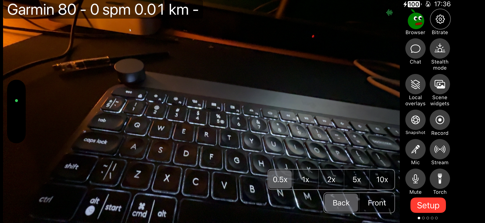
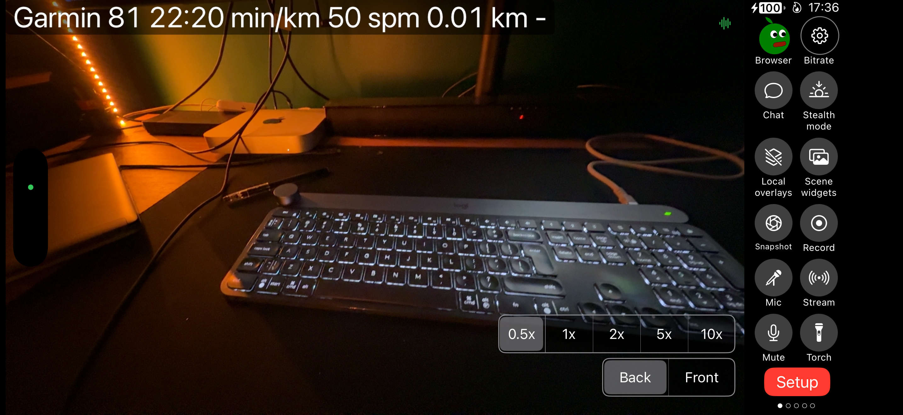

# Garmin BLE Integration - Summary

Date: 2026-01-31
Scope: Garmin BLE GATT (Fenix 8) integration + stream overlay metrics + status UI.

## Goal
- Add Garmin watch data to stream overlays and status area.
- Initial metrics: heart rate, pace, cadence, distance.
- Support multiple watches, but only one "current" watch drives overlay stats.
- Allow configurable units, manual distance reset, and per-device enable/disable.

## Data Sources (BLE GATT)
- Heart Rate Service: 0x180D
  - Measurement: 0x2A37 (HR)
- Running Speed & Cadence Service (RSC): 0x1814
  - Measurement: 0x2A53 (speed, cadence, optional total distance)

## Core Implementation
File: `Moblin/Integrations/GarminDevice/GarminDevice.swift`
- Uses CoreBluetooth and a dedicated queue.
- Scans for peripherals and connects by stored UUID (deviceId).
- Parses:
  - HR: uint8/uint16 depending on flags.
  - RSC: speed (m/s), cadence (spm), optional total distance (0.1 m units).
- Distance behavior:
  - If device provides total distance, it is used.
  - Otherwise, integrates speed over time as a fallback.

## Model + State
File: `Moblin/Various/Model/ModelGarminDevice.swift`
- Maintains Garmin devices + metrics keyed by Settings device UUID.
- Status logic:
  - If 1 enabled device: status text shows connection state (Disconnected/Discovering/Connecting/Connected).
  - If >1 enabled devices: status text shows "connected/total" count (e.g. 1/2).
- Metrics are cleared on disable or disconnect to avoid stale overlays.
- "Current" device selection:
  - Set when opening a device settings screen.
  - If not set, uses the first enabled device.

## Overlay + Tokens
Files:
- `Moblin/VideoEffects/Text/TextEffect.swift`
- `Moblin/VideoEffects/Text/TextEffectFormatter.swift`
- `Moblin/VideoEffects/Text/TextFormatStringLoader.swift`
- `Moblin/Various/Model/ModelScene.swift`

Tokens (for text widgets):
- `{garminHeartRate}`
- `{garminPace}`
- `{garminCadence}`
- `{garminDistance}`

Suggestion string added:
- "Garmin {garminHeartRate} {garminPace} {garminCadence} {garminDistance}"

## UI / Settings
Files:
- `Moblin/Various/Settings/Settings.swift`
- `Moblin/View/Settings/SettingsView.swift`
- `Moblin/View/Settings/GarminDevices/GarminDevicesSettingsView.swift`
- `Moblin/View/Settings/GarminDevices/GarminDeviceSettingsView.swift`
- `Moblin/View/Settings/GarminDevices/GarminDeviceScannerSettingsView.swift`
- `Moblin/View/Settings/Display/LocalOverlays/LocalOverlaysSettingsView.swift`

Settings added:
- `SettingsGarminDevices` (list of devices)
- `SettingsGarminDevice` (name, enabled, peripheral name/id)
- `SettingsGarminUnits`:
  - Pace: min/km or min/mi
  - Distance: km or mi

Distance reset:
- Button in Garmin device settings screen.
- Applies per-device offset so displayed distance starts from zero.

## Status Overlay
File: `Moblin/View/Stream/Overlay/StreamOverlayRightView.swift`
- Adds Garmin status row with watch icon.
- Color turns red if any enabled device is not connected.
- Visibility controlled by `SettingsShow.garminDevice` (local overlays toggle).

## Remote Control
File: `Moblin/RemoteControl/RemoteControl.swift`
- Remote scene text stats include Garmin fields.
- Optional strings used for backwards compatibility.

## Behavior Summary
- Multiple Garmin devices supported, but text overlays show metrics from the "current" device.
- Status area shows connection state/count and a red warning if any enabled device is disconnected.
- Units configurable globally in Garmin devices settings.
- Distance reset is manual and per device.

## Working State Evidence
- HR Broadcast must be enabled on the watch for HR/RSC advertising.
  
- Example when only partial data is transmitted (metrics missing/blank).
  
- Example with pace and distance successfully transmitted and displayed.
  

## Assumptions / Constraints
- Uses standard BLE GATT services (HR, RSC), no Garmin proprietary protocol.
- RSC total distance may be absent; fallback uses integrated speed and will drift over time.
- Connection is by peripheral UUID; if a watch changes UUID, the device must be re-selected.
- iOS does not expose a list of all "paired" BLE devices; the watch must be advertising or already connected.
  - On Garmin, HR/RSC often only advertise while an activity is running or when HR Broadcast is enabled.
  - Scanner now includes already-connected peripherals with matching services.

## Known Gaps / Future Work
- Explicit "current Garmin device" selector in list (currently set on device settings open).
- Optional smoothing/averaging for pace/cadence.
- Device-specific units or additional Garmin metrics (e.g., power, GPS speed).
- Persist distance reset across app restarts (current offset is in-memory only).

## Files Modified/Added
Added:
- `Moblin/Integrations/GarminDevice/GarminDevice.swift`
- `Moblin/Various/Model/ModelGarminDevice.swift`
- `Moblin/View/Settings/GarminDevices/GarminDevicesSettingsView.swift`
- `Moblin/View/Settings/GarminDevices/GarminDeviceSettingsView.swift`
- `Moblin/View/Settings/GarminDevices/GarminDeviceScannerSettingsView.swift`

Modified:
- `Moblin/Various/Model/Model.swift`
- `Moblin/Various/Model/ModelScene.swift`
- `Moblin/Various/Settings/Settings.swift`
- `Moblin/VideoEffects/Text/TextEffect.swift`
- `Moblin/VideoEffects/Text/TextEffectFormatter.swift`
- `Moblin/VideoEffects/Text/TextFormatStringLoader.swift`
- `Moblin/View/Settings/Display/LocalOverlays/LocalOverlaysSettingsView.swift`
- `Moblin/View/Settings/Scenes/Widgets/Widget/Text/WidgetTextSettingsView.swift`
- `Moblin/View/Settings/SettingsView.swift`
- `Moblin/View/Stream/Overlay/StreamOverlayRightView.swift`
- `Moblin/RemoteControl/RemoteControl.swift`
- `MoblinTests/TextEffectSuite.swift`
